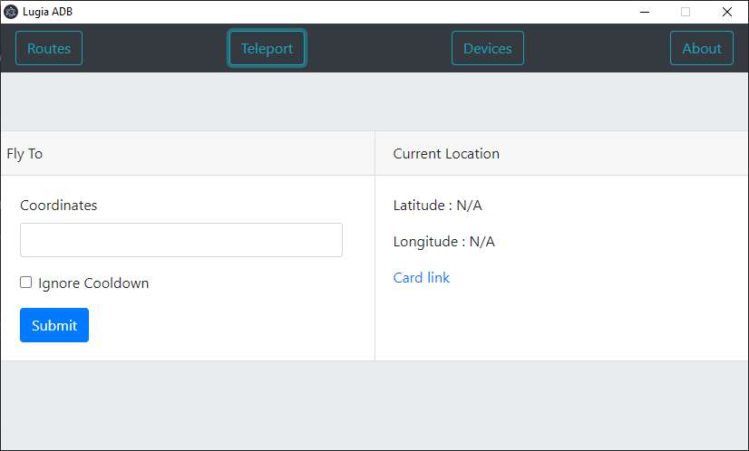
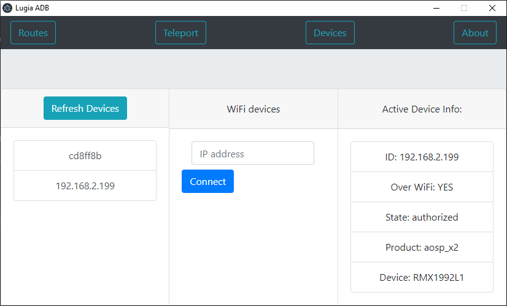

# Lugia_ADB
Application to control android device through ADB

# How to setup
To run this your android device must have android debugging enabled in developer settings.
Also App Ninja's joystick application must be installed on your device.

## Windows:
    Download the application from https://github.com/yatendra1999/Lugia_ADB/releases
    Extract exe from zip and run the application.

## Linux:
    Run the following commands in terminal:
        sudo apt update
        sudo apt install adb 

    From  https://github.com/yatendra1999/Lugia_ADB/releases,
    download the appimage and run it, or download the deb file and install it.

# FAQs:

## Teleport does not work for me:
    1. Check if adb is running correctly on your device.
    2. You have the correct joystick application installed.
    3. You have selected an actual device in devices section after refreshing devices.

## Cannot connect device over wifi:
    1. Verify if adb is enabled in tcpip mode.
        To enable it in tcpip mode, connect normally through usb and run "adb tcpip 5555" to restart in tcpip mode with port 5555.

## What is the route file format:
    The route file must be .txt and must contain the coordinates in the format:
        40,-73
        40.234,-73.845
        .
        .
        .
        40.12,-73.9

# Screenshot
Teleport:

Devices:

Routes:

